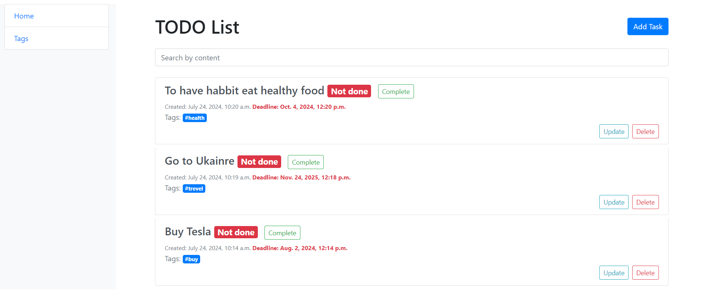

# TODO list

Web Site to help you keep track of your tasks and stay organized.

## Check it out!

Python3 must be already installed

```shell
git clone https://github.com/BohdanKuzik/Todo_List.git
cd Todo_List
python3 -m venv venv
pip install -r requirements.txt
python manage.py migrate
python manage.py generator_data
python manage.py runserver
```

After running that code you'll be able to browse the website locally on your computer.
## Demo
